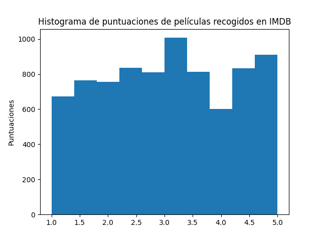
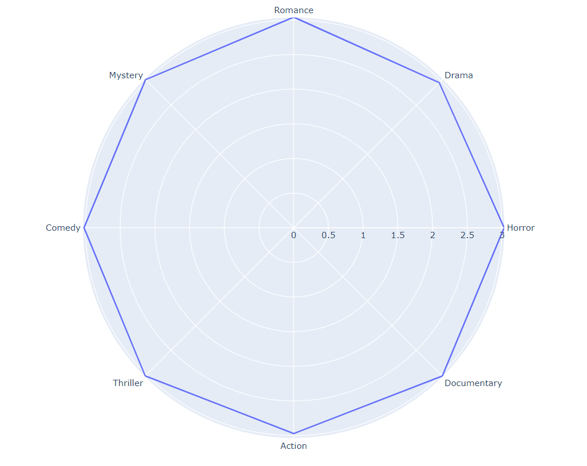

# PEC 2 - Técnicas de visualización de datos

- **Autor:** José Miguel Gamarro Tornay.
- **Asignatura:** Visualización de datos.
- **Máster de ciencia de datos**

## Descripción

En esta página se procede a mostrar algunos ejemplos de diferentes técnicas para visualizar datos.

## Fuente de datos

Para el presente trabajo académico, se ha procedido a utilizar un data set de evaluaciones de películas por género en IMDB [evaluaciones de películas por género en IMDB](https://zenodo.org/record/7339445/files/IMDB%20Selection%20Database.csv?download=1)

## Histograma

El primer ejemplo que vamos a visualizar, se trata de un histograma. Como los datos de puntuación de películas tienen una puntuación, vamos a representar el histograma de la puntuación de las mismas.

## Radar Chart

A continuación, vamos a observar un ejemplo de como sería un "*Radar Chart*", para ello vamos a usar las puntuaciones medias de cada género de película del data set anterior:

## Sparklines

Por último, vamos a enseñar como representamos mediante "*Sparklines*" (Pequeños gráficos secuenciales) la evolución de las puntuaciones por tipo de género de películas:

